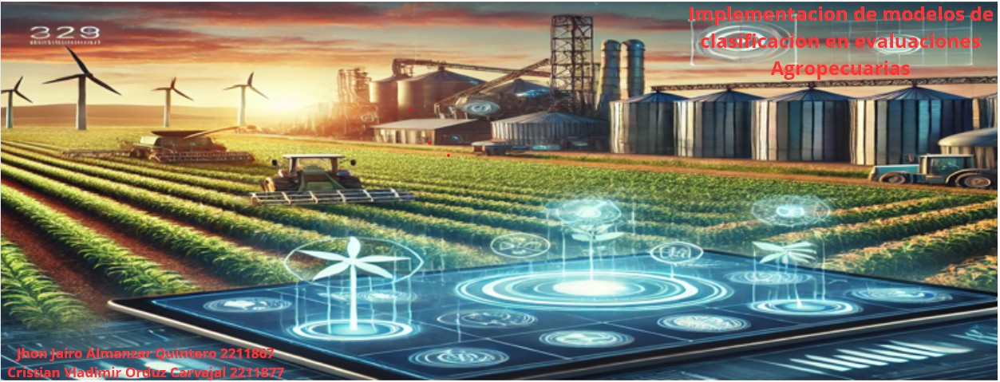

# Implementacion de modelos de clasificacion en evaluaciones Agropecuarias

Autores:Cristian Vladimir Orduz Carvajal 2211877, Jhon Jairo Almanzar Quintero 2211867

El objetivo de este trabajo es abordar los desafíos del sector agropecuario, como la optimización de cultivos y la predicción de rendimientos, mediante el uso de modelos de inteligencia artificial. Se implementarán DecisionTreeClassifier, RandomForestClassifier y SVC para clasificar datos agropecuarios, así como aprendizaje no supervisado... para obtener mas información.

Dataset: #LINK DEL DATASET

Modelos: DecisionTreeClassifier, RandomForestClassifier, SupportVectorMachine, Redes neuronales.

Enlaces [
Video: https://youtu.be/yjGace4Ad1Q  

Codigo: https://colab.research.google.com/drive/1g2AV3_2Uu-1PZvxqTkRXOs9-OwiZDxEb?authuser=1#scrollTo=1BTSRlK_k91y&uniqifier=1  

Repositorio:
]
